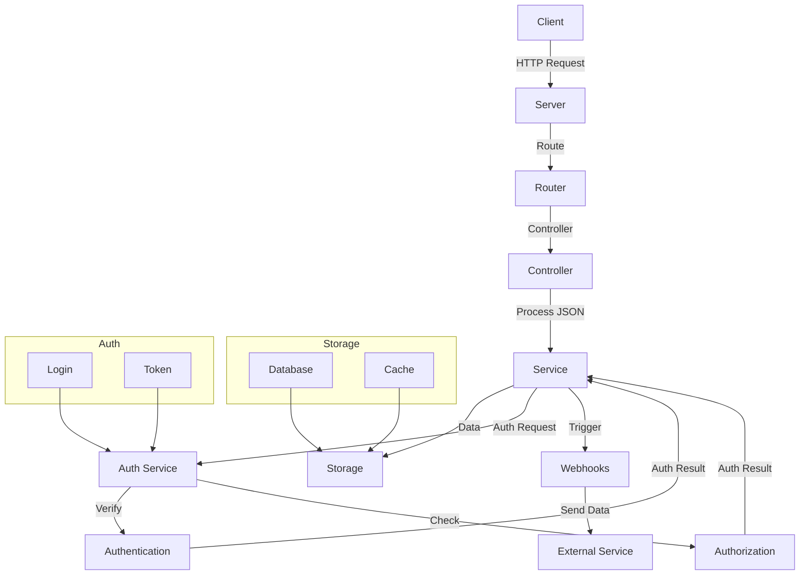

Building a Go Web Server from scratch.

A web server is just a computer that serves data over a network, typically the Internet.

Servers run software that listens for incoming requests from clients. When a request is received, the server responds with the requested data.

Brief explanation of the key points from the graph above:
- **Client**: Initiates the HTTP request.
- **Server**: Handles the incoming HTTP request.
- **Router**: Directs the request to the appropriate controller.
- **Controller**: Processes the request and interacts with the service layer.
- **Service**: Manages business logic, interacts with storage, and handles authentication/authorization.
- **Storage**: Consists of a database and cache for storing data.
- **Auth Service**:
  - Login: Manages user login.
  - Token: Handles token creation and verification.
- **Authentication**: Verifies user credentials.
- **Authorization**: Checks user permissions.
- **Webhooks**: Manages webhooks and sends data to external services.
- **External Service**: Receives data from webhooks.
